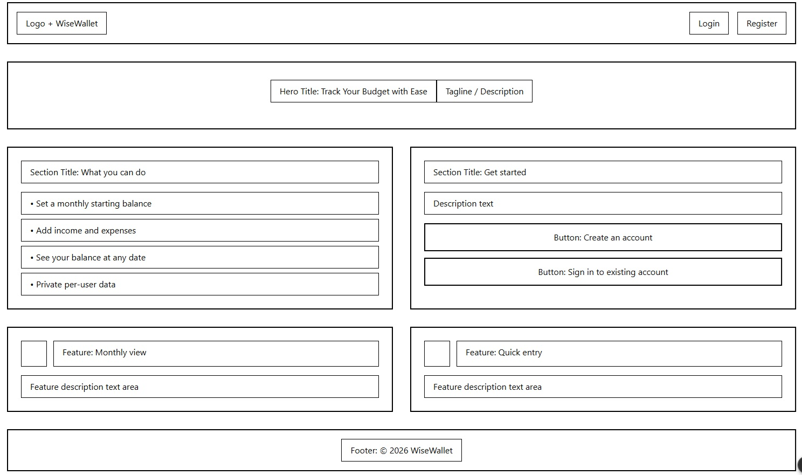
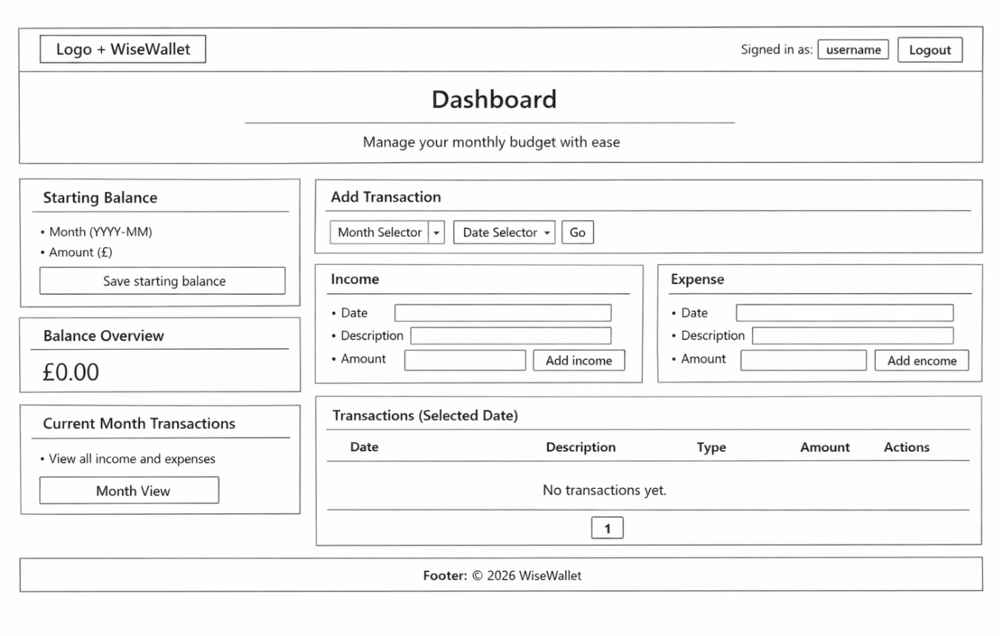
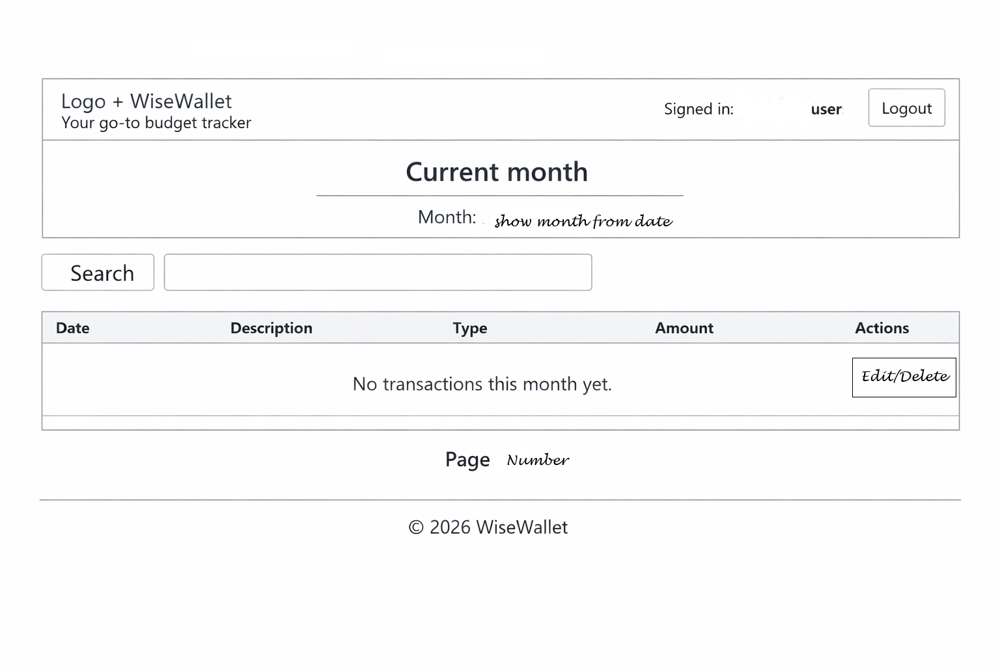
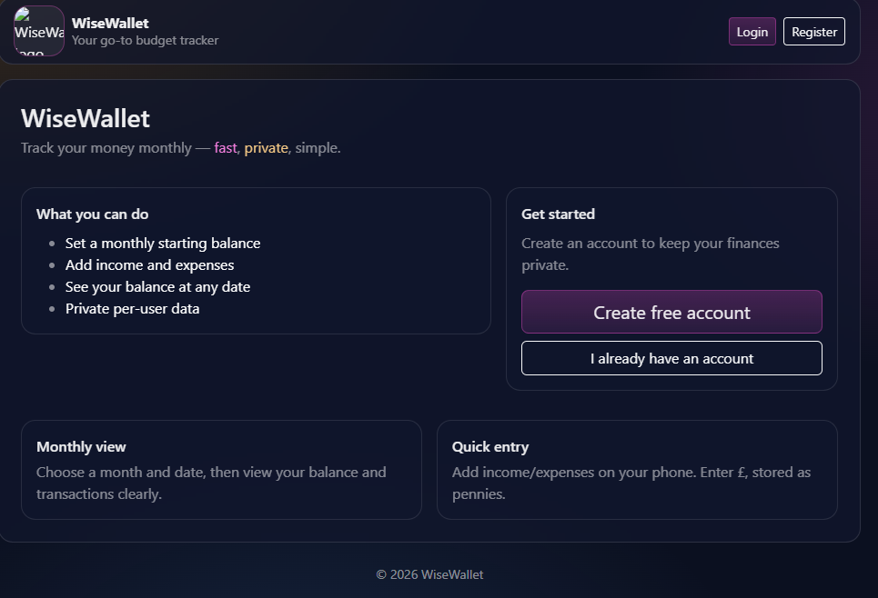
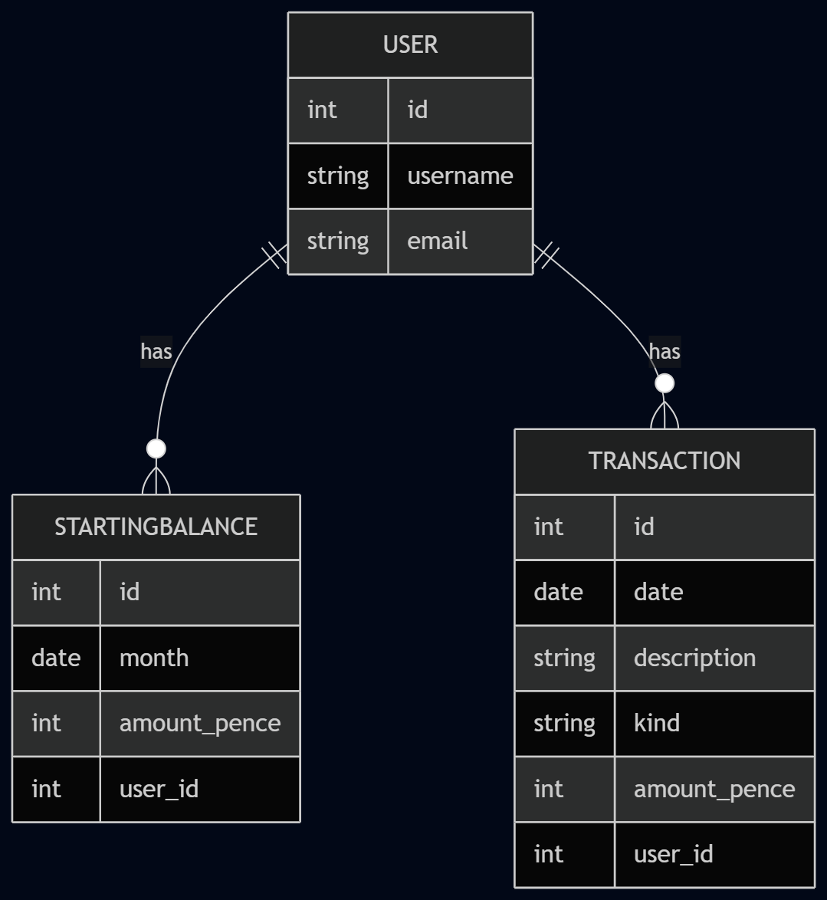

# WiseWallet


The repository for my Code Institute Bootcamp capstone project, built after 14 weeks of learning HTML, CSS, JavaScript, and Python.

WiseWallet is a simple, private monthly budget tracker that lets users:

- set a monthly starting balance
- add income and expense transactions
- view a month’s transactions
- see their balance up to a selected date

---

## Table of Contents

- [Project Overview](#project-overview)
- [Technologies Used](#technologies-used)
- [Project Aims](#project-aims)
- [User Roles/Personas](#user-rolespersonas)
- [User Stories](#user-stories)
- [User Experience Design](#user-experience-design)
    - [Landing Page](#landing-page)
    - [Dashboard Page](#dashboard-page)
    - [Creative Design Decisions](#creative-design-decisions)
- [Database Design](#database-design)
- [Application Breakdown](#application-breakdown)
    - [capstone (project)](#capstone-project)
    - [wallet (app)](#wallet-app)
- [Features](#features)
- [Agile Methodology](#agile-methodology)
    - [Project Board](#project-board)
- [Testing](#testing)
    - [Initial Testing](#initial-testing)
    - [Lighthouse Report](#lighthouse-report)
    - [CSS Testing (W3C)](#css-testing-w3c)
    - [HTML Testing (W3C)](#html-testing-w3c)
    - [Manual Test Cases for WiseWallet User Stories](#manual-test-cases-for-wisewallet-user-stories)
- [Deployment](#deployment)
- [Real-Time Testing/Alerts](#real-time-testingalerts)
- [Use of AI](#use-of-ai)
- [Future Enhancements](#future-enhancements)
- [Credits](#credits)

---

## Project Overview

WiseWallet is a web application designed to help users track their money monthly in a clear and private way.

The app focuses on core budgeting fundamentals:

- a starting balance per month
- income and expense transactions
- a running balance calculation
- the ability to view a balance at a selected date

---

## Technologies Used

- **Python**: Primary backend language.
- **Django**: Web framework powering the application.
- **HTML**: Page structure and Django templates.
- **CSS**: Styling.
- **Bootstrap 5**: Responsive UI components and layout.
- **django-allauth**: Authentication (signup/login/logout).
- **SQLite (development)**: Default local database.
- _(Optional for deployment)_ **PostgreSQL**, **Whitenoise**, **gunicorn**, **python-decouple / dotenv**.

---

## Project Aims

The primary aims of this project are to:

- Provide a user-friendly monthly budget tracker.
- Keep financial data private per user (authentication + ownership enforcement).
- Allow fast entry of income and expenses.
- Provide clear calculations (store money as pennies/pence to avoid floating point issues).
- Deliver a responsive web application usable on mobile and desktop.

---

## User Roles/Personas

WiseWallet is designed around two main personas:

1. **Visitor**

- Can view the landing page
- Can register for an account

2. **Authenticated User**

- Can view and manage their own starting balances and transactions
- Cannot see or modify any other user’s data

---

## User Stories

### MUST HAVE

- **User registration**
    - As a Visitor, I can register for a WiseWallet account, so that I can create a private account and start tracking my finances.

- **Login / Logout**
    - As a Registered user, I can log in and log out, so that my financial data stays secure and only I can access it.

- **Set starting balance (single account)**
    - As a User, I can set a required starting balance (£) for the current month, so that WiseWallet can calculate accurate balances from a known starting point.

- **Add income transaction**
    - As a User, I can add an income transaction with date, amount (£), and description, so that my income is included in my balance and transaction history.

- **Add expense transaction**
    - As a User, I can add an expense transaction with date, amount (£), and description, so that my spending is included in my balance and transaction history.

- **View transactions list (current month)**
    - As a User, I can view my current-month transactions in date order, so that I can review my activity and understand changes to my balance.

- **Edit transaction**
    - As a User, I can edit an existing transaction that belongs to me, so that I can correct mistakes and keep my records accurate.

- **Delete transaction**
    - As a User, I can delete an existing transaction that belongs to me, so that I can remove incorrect or unwanted entries and keep my history accurate.

- **Show balance at selected date**
    - As a User, I can choose a date in the current month and see my balance up to and including that date, so that I know what my balance was at any point in time.

- **Enforce ownership permissions (transactions + starting balance)**
    - As a User, I can only view and modify my own starting balance and transactions, so that other users cannot access or change my private financial data.

- **Automated tests for balance logic + permissions**
    - As a Developer, I can run automated tests covering penny-based balance calculations and ownership permissions, so that I can trust the core logic and prevent security regressions.

---

## User Experience Design

The UX focuses on:

- **Ease of use**: minimal steps to add income/expenses
- **Clarity**: month + selected date filters, visible balance numbers
- **Privacy**: per-user accounts and data separation
- **Responsiveness**: works on mobile and desktop
- **Visual design**: “glass” / dark theme with soft gradients (Bootstrap-based)

### Landing Page

The landing page introduces WiseWallet and prompts unauthenticated users to:

- Login
- Register

### Dashboard Page

The dashboard is the core budgeting view and allows a logged-in user to:

- select a month and date
- set/update starting balance for a month
- add income/expense transactions
- view a list of month transactions
- view balance at selected date

### Creative Design Decisions

WiseWallet uses:

- a dark gradient background for a modern “finance dashboard” feel
- glass-style panels for content sections
- Bootstrap layout to ensure mobile-first responsiveness

Wireframe Layout:

Landing Page



Dashboard



Monthly View allowing edit and delete



## WiseWallet Landing Page Mockup



---

## Database Design

### Core models

- **StartingBalance**
    - user (FK)
    - month (Date stored as the 1st day of the month, e.g. 2026-03-01)
    - amount_pence (Integer)

- **Transaction**
    - user (FK)
    - date
    - description
    - kind (Income/Expense)
    - amount_pence (Integer)

Money is stored as **pence** to keep calculations safe and consistent.



---

## Application Breakdown

### capstone (project)

Purpose: Django project configuration:

- settings
- root URLs
- deployment config (ASGI/WSGI)

### wallet (app)

Purpose: Core WiseWallet app:

- models for balances and transactions
- forms for adding/editing data
- views for landing page + dashboard
- templates for UI pages

---

## Features

- User authentication and registration via **django-allauth**
- Private, per-user data (starting balances + transactions)
- Starting balance per selected month
- Add income + expense transactions
- Transactions list for selected month
- Balance at selected date
- Responsive UI using Bootstrap

---

## Agile Methodology

This project follows Agile practices:

- User stories tracked as GitHub issues
- Iterative development with MVP-first delivery

### Project Board

A GitHub project board is used to manage:

- Backlog
- To Do
- In Progress
- Done

_(Add your board link here once created.)_

---

## Testing

### Initial Testing

Manual testing includes:

- signup/login/logout
- dashboard access control (redirect if logged out)
- starting balance creation/update
- income/expense creation
- balance calculations

### Manual Test Cases for WiseWallet User Stories

| User Story / Feature                | Test Steps                                                                  | Expected Result                          | Pass/Fail | Notes |
| ----------------------------------- | --------------------------------------------------------------------------- | ---------------------------------------- | --------- | ----- |
| Register a new user                 | 1. Go to Register page<br>2. Fill in username, email, password<br>3. Submit | Account created, redirected to dashboard | Pass      |       |
| Login as existing user              | 1. Go to Login page<br>2. Enter valid credentials<br>3. Submit              | Dashboard loads, user info shown         | Pass      |       |
| Logout                              | 1. Click "Logout" in navbar                                                 | Redirected to login page                 | Pass      |       |
| Add income transaction              | 1. On dashboard, fill "Add income" form<br>2. Submit                        | Transaction appears in list              | Pass      |       |
| Add expense transaction             | 1. On dashboard, fill "Add expense" form<br>2. Submit                       | Transaction appears in list              | Pass      |       |
| Edit a transaction                  | 1. Click "Edit" on a transaction<br>2. Change details<br>3. Save            | Transaction updated in list              | Pass      |       |
| Delete a transaction                | 1. Click "Delete" on a transaction<br>2. Confirm deletion                   | Transaction removed from list            | Pass      |       |
| Upload CSV of transactions          | 1. Click "Upload CSV"<br>2. Select valid CSV<br>3. Submit                   | Transactions imported, listed            | Pass      |       |
| Reset month                         | 1. Click "Reset Month"<br>2. Confirm action                                 | All transactions deleted for month       | Pass      |       |
| View month transactions             | 1. Click "Month View"                                                       | All transactions for month listed        | Pass      |       |
| Print month report                  | 1. Click "Print Month Report"<br>2. View/print page                         | Printable report displays                | Pass      |       |
| See starting balance                | 1. View dashboard<br>2. Check "Starting balance" panel                      | Correct balance shown                    | Pass      |       |
| Change starting balance             | 1. Edit "Starting balance" form<br>2. Submit                                | Balance updates, reflected in dashboard  | Pass      |       |
| Accessibility: keyboard navigation  | 1. Tab through all interactive elements                                     | All controls accessible by keyboard      | ?         |       |
| Accessibility: screen reader labels | 1. Use screen reader on forms/buttons                                       | All controls have meaningful labels      | ?         |       |

### Lighthouse Report


### CSS Testing (W3C)


### HTML Testing (W3C)

## All templates passed without errors (minor change to from using template Django to js in messages)

## Deployment

Heroku Deployment

Typical deployment considerations:

- set `DEBUG=False`
- configure `ALLOWED_HOSTS`
- configure `SECRET_KEY`
- configure database (PostgreSQL)
- configure static file serving (Whitenoise)
- run migrations in production

---

## Real-Time Testing/Alerts

Toast messages used:

- error tracking
- performance monitoring
- alerting user

---

## Use of AI

GitHub Copilot and AI assistance were used to:

- draft user stories and acceptance criteria
- troubleshoot Django errors (e.g., URL reverse issues)
- speed up repetitive code writing (with review and understanding before applying)

---

## Future Enhancements

- Edit transaction UI + endpoint
- Delete transaction UI + endpoint
- Month navigation improvements and richer filtering
- Monthly totals (income/expense/net)
- Categories and budgets
- CSV export
- Better currency handling with `Decimal`
- Improved test coverage and CI pipeline

---

## Local Setup

### 1) Clone and install dependencies

```bash
git clone <repo-url>
cd <repo>
python -m venv .venv
# activate venv
pip install -r requirements.txt
```

### 2) Migrate and run

```bash
python manage.py makemigrations
python manage.py migrate
python manage.py createsuperuser
python manage.py runserver
```

### 3) Configure Allauth Site (required)

- Go to `/admin`
- **Sites** → ensure Site ID 1 has your domain (e.g. `127.0.0.1:8000` / `localhost:8000`)

---

## Credits

- Code Institute: educational foundation and project guidance
- Django: framework
- django-allauth: authentication and account management
- Bootstrap: responsive UI components
